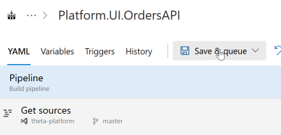
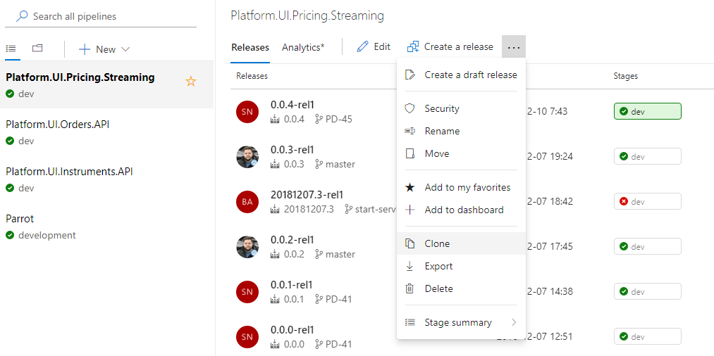

# Azure DevOps Pipelines

Azure DevOps has two types of "pipeline":
- Build
- Release

Azure DevOps supports providing a YAML configuration file, `azure-pipelines.yml`, to define a Build pipeline.

## Creating a Build Pipeline
Assuming you have already created an `azure-pipelines.yml` file at the root of the project you are working on (should usually be alongside the `Dockerfile`), you may expect Azure DevOps to reflect the new pipeline you defined immediately after commit. 

Sadly that's not the case, so here's a guide on how to get the pipeline showing in the UI - written for posterity as this flow is not exactly intuitive.

### Step 1: Navigate to Pipelines > Build and click on "New build pipeline"
- 

### Step 2: (Unintuitively) Click on the "Use visual designer without YAML" link
- 

### Step 3: Select the repository
- 

### Step 4: Select YAML as the starting template
- 

### Step 5: Navigate to and select the path in which your `azure-pipelines.yml` resides
Note that for service pipelines there is a shared generic pipeline yml in the src folder.
- 

### Step 6: Enter a name for the pipeline and ensure the path is correct
- 

### Step 6A: If creating a service pipeline, create the necessary build variables
These are documented in the generic `azure-pipelines.yml` file.
- 

### Step 6B: If creating a service pipeline, add the triggers manually
At the time of writing build variables in trigger paths do not seem to be working.  A [GitHub issue](https://github.com/MicrosoftDocs/vsts-docs/issues/2691) has been raised for this.
- 

### Step 7: Save and queue your first build
- 

### Step 8: Done! 
Your build should now display in the UI and be linked to the `azure-pipelines.yml` file for further updates later on.

## Creating a Release Pipeline

At the time of writing, defining Release Pipelines with YAML is not supported, but is planned. This [work item](https://dev.azure.com/mseng/Azure%20DevOps%20Roadmap/_workitems/edit/1221170) tracks their nearness to public release.

Therefore to create a Release Pipeline you'll need to clone an existing Pipeline.

### Step 1: Clone Pipeline
- 

### Step 2: Rename the Pipeline
- 

### Step 3: Remove the Artifact and add a new one for the correct corresponding Build Pipeline
- 

### Step 4: Enable the Continuous deployment trigger and add a branch filter
- 

### Step 5: Update the Variables
- 

### Step 6: Click Save and Queue your first release
