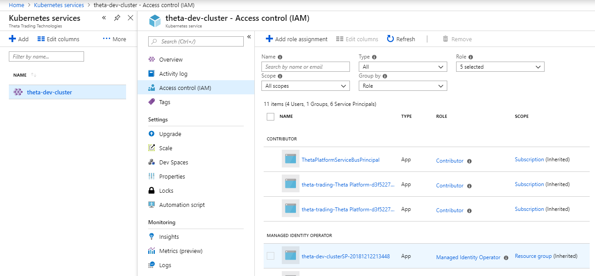
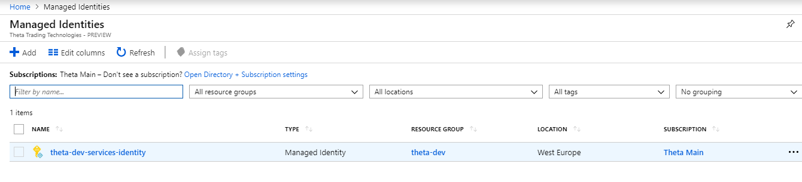
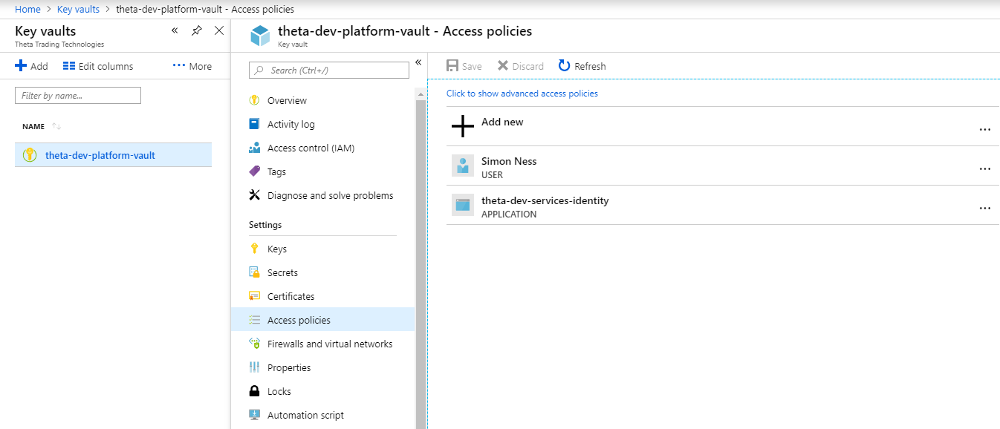
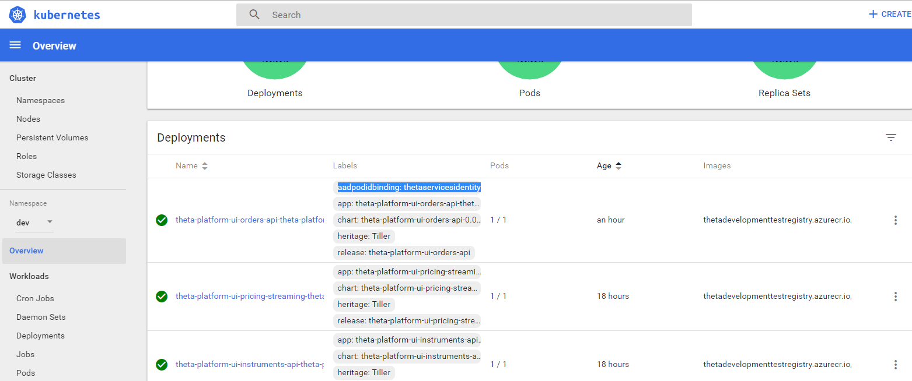

# Configuration

We intend to use [convention over configuration](https://en.wikipedia.org/wiki/Convention_over_configuration) to minimize explicit configuration as this will quickly become hard to manage in a single tenant environment (environment per client in production).

Based on a theta environment name (a 3 characters code, e.g. `dev`) we should be able to determine by convention, things like resource names, connection strings, usernames etc. Note that we're restricting the length of the environment name to 3 characters to aid infrastructure configuration as some Azure Resources have a strict maximum length naming requirement.

## Infrastructure Configuration

Based on Microsoft's excellent [guide](https://docs.microsoft.com/en-us/azure/architecture/best-practices/naming-conventions) about naming Azure resources we have agreed the following naming conventions:

An environment will consist of:
- A top level Resource Group named with the pattern `theta-<env>` (e.g. `theta-dev`)
- Resources named with the pattern `theta-<env>-<description>` (e.g. `theta-dev-cluster`, `theta-dev-registry`)
- Storage accounts only allow alphanumeric characters, a maximum 24 characters and must be globally unique, so will be named with the pattern `theta<env><description>` (this leaves 16 characters for the `<description>` part, e.g. `thetadevorders`)

How we configure infrastructure will depend on the IaS tool we choose.  For now the decision process is documented in [PD-46](https://theta-trading.atlassian.net/browse/PD-46), but this wiki page will be expanded to become the source of truth once a tool has been selected and it's in use.

## Application Configuration

Until there is a need for explicit non secret configuration, so excluding things like passwords, there won't be a token replacement mechanism in the Azure DevOps Release pipeline (to set / change application configuration at deployment time), or a configuration service (to set / change application configuration at runtime).

We can set the minimal set of configuration variables required to determine all other convention based configuration values using helm to set enviornment variables on the pod (i.e. environment name and application version).

### Secret Management

We use Azure Key Vault to manage secrets.  To allow an application running in an Azure Kubernetes Service we use a Managed Identity, giving that Identity read access on the Vault and using [aad-pod-identity](https://github.com/Azure/aad-pod-identity) to allow the application to securely assume the Identity.  This will be scripted in environment setup, see [New Environment](New-Environment.md), but can be seen in the portal as follows:

The Kubernetes Service's Sevice Principal has the 'Managed Identity Operator' role (note this is automatic if the SP is created with the AKS):

A Managed Identity:

Allowed read access on a Key Vault:

aad-pod-identity deploys two pods, a MIC (Managed Identity Controller) and NMI (Node Managed Identity).  These currently have to be deployed to the `default` namespace in Kubernetes (see [#115](https://github.com/Azure/aad-pod-identity/issues/115)).  You can follow the [Did it work?](https://github.com/Azure/aad-pod-identity/tree/master/docs/tutorial#did-it-work) section of the aad-pod-identity tutorial or use the Kubernetes Dashbaord to view their logs and diagnose issues.

During a deployment, a deployment with a matching `aadpodidbinding` label to an AzureIdentiyBinding's `selector` will have an AzureAssignedIdentity created allowing the pod to acquire access tokens for the Managed Indentity.

To add or update secrets we could call the vault programmatically or allow certain users access to use the portal.
